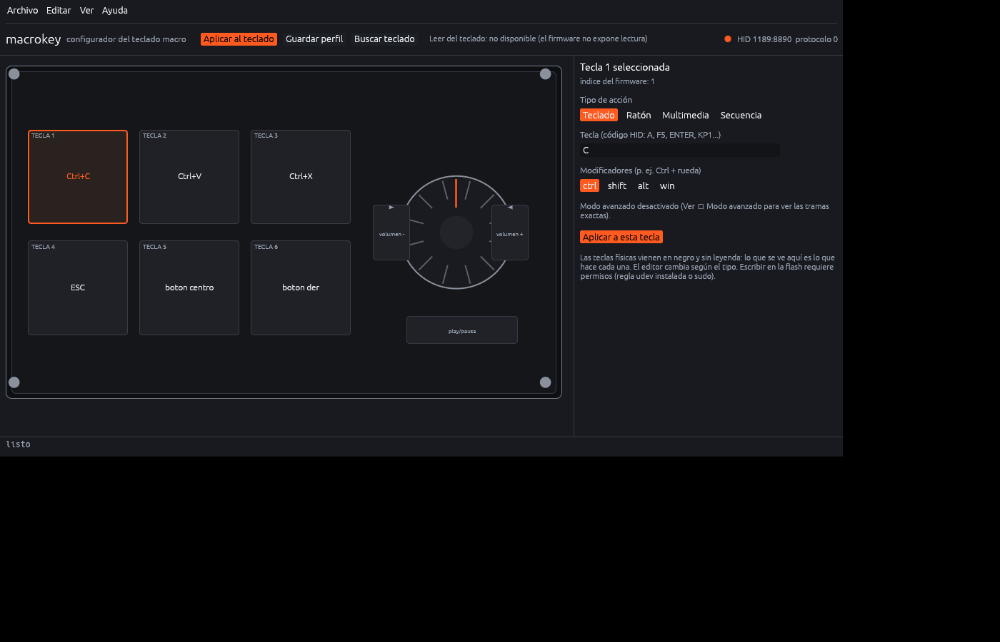

# macrokey

**Configurador libre para el teclado macro de 6 teclas + perilla** (VID `0x1189`).

Sin software del fabricante · sin instalador · un solo binario sin dependencias C · Linux y Windows · castellano e inglés.

[](LICENSE)
[](#descarga)
[](https://github.com/danieltobon21/macro-key-setup/actions/workflows/build.yml)



## Qué es

Un teclado pequeño: seis teclas mecánicas en negro y sin leyenda, una perilla moleteada (girar a la izquierda / pulsar / girar a la derecha) y un puerto USB-C. Funciona en cualquier ordenador como teclado HID estándar, pero para cambiar lo que hace cada tecla hace falta el programa de Windows del fabricante (`MINI KeyBoard.exe`), que es cerrado, no está firmado, se distribuye por HTTP sin cifrar y **escribe en la flash del aparato sin comprobar nada**.

`macrokey` sustituye a ese programa. El protocolo se reconstruyó por ingeniería inversa del binario del fabricante y después se verificó tecla por tecla contra el aparato; aquí no hay ni una línea del código original. El formato completo está en [`docs/PROTOCOL.md`](docs/PROTOCOL.md).

## Lo que hace

- **Una ventana que enseña tu teclado.** Las seis teclas y la perilla se dibujan a escala real (100 × 60 mm, 1 mm = 6 px) y cada tecla lleva escrito lo que hace ahora mismo. Pinchas una tecla, eliges la acción y aplicas.
- **Por tecla:** combinaciones de teclado con modificadores, botones y rueda del ratón — **mantenidos mientras mantienes la tecla**, así que sirven para moverte y girar la vista —, teclas multimedia y secuencias de varias teclas con retardo.
- **La configuración vive dentro del teclado.** Lo desenchufas y funciona en otro ordenador: sin drivers, sin programas, sin instalar nada.
- **Castellano e inglés**, cambiables en caliente. **Portable**: el fichero de preferencias va junto al ejecutable, no toca el registro de Windows ni `~/.config`.
- **CLI y perfiles TOML**, con `--dry-run` para ver las tramas exactas antes de escribir nada.
- **Sin dependencias externas.** En Linux habla con `/dev/hidraw` y con USB directo; en Windows usa la API HID del sistema. Ni libusb ni hidapi.
- **Probado:** un script de regresión (`tools/comparar-tramas.py`) compara byte a byte las tramas que construye el prototipo en Python y las que construye el programa en Rust.

<p>


</p>

## Descarga

| plataforma | |
|---|---|
| **Windows 10/11** | [`macrokey.exe`](../../releases) — doble clic. Sin instalador, sin ventana de consola y sin permisos de administrador. |
| **Linux** | compílalo (abajo) o coge el binario de la release. |

## Uso

Sin argumentos (o doble clic en el `.exe`) se abre la ventana. Desde la terminal:

```console
$ macrokey key --key 1 --codes C --mods ctrl        # tecla 1: Ctrl+C
$ macrokey key --key 5 --mouse middle               # tecla 5: botón central (mantener para mover la vista)
$ macrokey key --key 6 --media play                 # tecla multimedia
$ macrokey led --mode 2 --color blue                # LED (solo en unidades que lo lleven)
$ macrokey apply profiles/example.toml               # un perfil completo de una vez
$ macrokey apply profiles/example.toml --dry-run     # solo imprimir las tramas
```

En Linux el canal de configuración necesita permisos: o lo ejecutas con `sudo`, o instalas la regla udev una vez y te olvidas.

```bash
sudo cp udev/99-macrokey.rules /etc/udev/rules.d/
sudo udevadm control --reload && sudo udevadm trigger
```

Los perfiles son TOML normal. [`profiles/example.toml`](profiles/example.toml) es un punto de partida comentado; [`profiles/tinkercad.toml`](profiles/tinkercad.toml) es uno real (copiar/pegar/cortar, escape, mover y girar en Tinkercad, y la perilla para volumen y play/pausa).

## Cómo funciona

El teclado presenta cuatro interfaces HID. La interesante es la 1: un **canal de configuración de solo escritura** (informes de 64 bytes, report id 3) que acaba en la flash del aparato. Cada tecla son unos pocos bytes, y el firmware tiene una trampa que conviene conocer: un elemento con modificador y código 0 **deja ese modificador pulsado para siempre** — justo lo que le pasó una vez al programa original con el `Ctrl`. Este programa jamás genera una trama así.

Por ese canal no hay forma de leer la configuración (sus lecturas devuelven un byte fijo). En [`docs/HARDWARE.md`](docs/HARDWARE.md) está explicado cómo volcarla por el bootloader del microcontrolador, para quien tenga curiosidad por el formato de almacenamiento.

## Documentación

| | |
|---|---|
| [`docs/PROTOCOL.md`](docs/PROTOCOL.md) | el protocolo HID completo: tramas, tipos, tablas de códigos, mapa del ratón y de la perilla, y su verificación contra el aparato |
| [`docs/HARDWARE.md`](docs/HARDWARE.md) | qué hay dentro del teclado (CH552G) y cómo leer su configuración por el bootloader |
| [`docs/AUDITORIA-vendor.md`](docs/AUDITORIA-vendor.md) | auditoría de seguridad del programa del fabricante: qué hace y qué no hace |
| [`re/`](re) | material de ingeniería inversa: las tablas de códigos extraídas y el script que las produjo |
| [`proto/macrokey.py`](proto/macrokey.py) | el prototipo en Python con el que se descifró el protocolo, con un comando `monitor` que decodifica lo que envía el teclado |

## Compilar

```bash
cd rust
cargo build --release      # en Linux no hace falta nada más que Rust
```

Windows (toolchain MSVC):

```powershell
git clone https://github.com/danieltobon21/macro-key-setup C:\macrokey
cd C:\macrokey\rust
cmd /c '"C:\Program Files (x86)\Microsoft Visual Studio\2022\BuildTools\VC\Auxiliary\Build\vcvars64.bat" && cargo build --release'
```

Sale un binario único con el icono incrustado. Las etiquetas (tags) se compilan solas para Linux y Windows con el flujo de trabajo de [`.github/workflows/build.yml`](.github/workflows/build.yml) y se adjuntan a la release.

## Compatibilidad

Escrito para `1189:8890`. La familia comparte protocolo y el programa también reconoce `8830`, `8831`, `8832`, `8833`, `8834`, `8840` y `87d0`; si alguno no funciona, abre una incidencia con la salida de `macrokey list` y `macrokey probe`.

## Licencia y créditos

MIT — ver [LICENSE](LICENSE). Sin relación alguna con el fabricante del teclado.

Protocolo reconstruido del propio programa del fabricante (decompilado con `ilspycmd`, tablas de códigos extraídas y comprobadas contra el aparato) y de la documentación pública del bootloader ISP del WCH CH552. Gracias a los proyectos que documentaron el bootloader del CH552 y el protocolo ISP de WCH.

**Aviso:** el programa escribe en la memoria flash del teclado. Nunca construye una trama inválida y `--dry-run` enseña exactamente lo que se enviaría, pero guarda tu configuración en un perfil antes de experimentar.

---

[English version](README.md)
