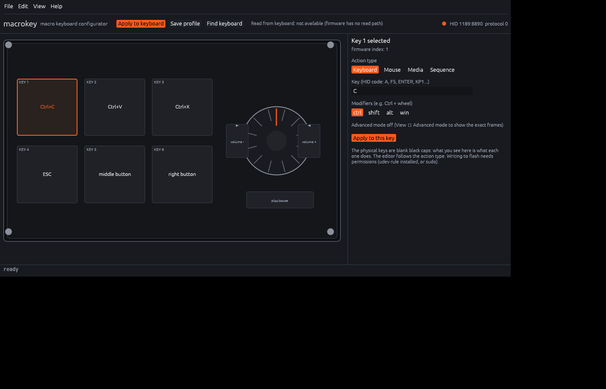
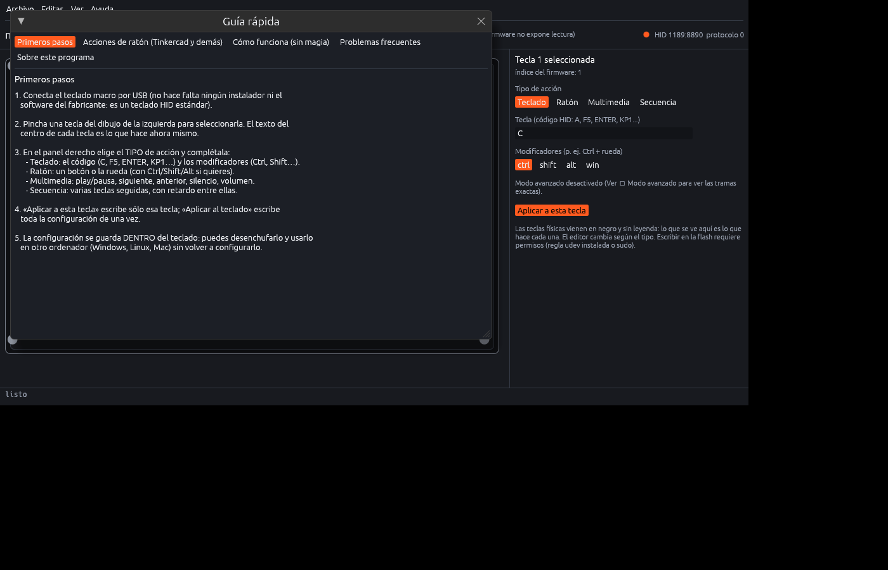
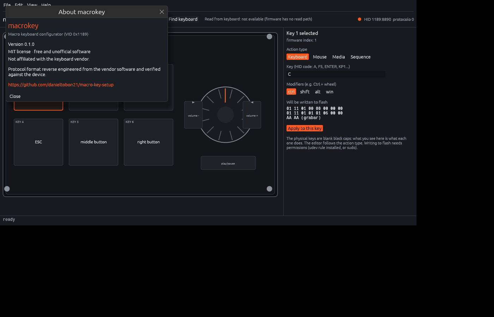

# macrokey

**Open configurator for the 6-key + knob macro keyboard** (VID `0x1189`).

No vendor software · no installer · one binary with no C dependencies · Linux and Windows · Spanish and English.

[](LICENSE)
[](#download)
[](https://github.com/danieltobon21/macro-key-setup/actions/workflows/build.yml)



## What it is

A little keyboard: six blank mechanical keys, a knurled knob (turn left / press / turn right) and a USB-C port. It works anywhere as a standard HID keyboard — but changing what a key does requires the vendor's Windows program (`MINI KeyBoard.exe`), which is closed source, unsigned, delivered over plain HTTP and **writes to the device's flash without verifying anything**.

`macrokey` replaces that program. The protocol was reverse engineered from the vendor binary and then verified key by key against the hardware; no vendor code is used or distributed here. The whole format is written down in [`docs/PROTOCOL.md`](docs/PROTOCOL.md).

## Features

- **A window that shows your keyboard.** The six keys and the knob are drawn to scale (100 × 60 mm, 1 mm = 6 px) and each key is labelled with what it does right now. Click a key, choose the action, apply.
- **Per key:** keyboard shortcuts with modifiers, mouse buttons and wheel — **held for as long as you hold the key**, so they work for pan/rotate/zoom — media keys, and multi-key sequences with a delay.
- **The configuration lives inside the keyboard.** Unplug it, carry it to another computer: no drivers, no software, nothing to install.
- **Spanish and English**, switchable at runtime. **Portable**: the settings file sits next to the executable — no Windows registry, no `~/.config`.
- **CLI and TOML profiles**, with `--dry-run` printing the exact frames before anything is written.
- **No third-party runtime dependencies.** Linux talks to `/dev/hidraw` and raw USB; Windows uses the native HID API. No libusb, no hidapi.
- **Tested:** a regression script (`tools/comparar-tramas.py`) compares the frames built by the Python prototype and by the Rust program, byte for byte.

<p>


</p>

## Download

| platform | |
|---|---|
| **Windows 10/11** | [`macrokey.exe`](../../releases) — double click. No installer, no console window, no admin rights. |
| **Linux** | build from source (below), or take the release binary. |

## Usage

Run it with no arguments (or double click the `.exe`) and the window opens. From a terminal:

```console
$ macrokey key --key 1 --codes C --mods ctrl        # first key: Ctrl+C
$ macrokey key --key 5 --mouse middle               # fifth key: middle button (hold it to pan)
$ macrokey key --key 6 --media play                 # media key
$ macrokey led --mode 2 --color blue                # LED (only on units that have one)
$ macrokey apply profiles/example.toml               # a whole profile at once
$ macrokey apply profiles/example.toml --dry-run     # just print the frames
```

On Linux the configuration channel needs permission: run with `sudo`, or install the udev rule once and forget about it.

```bash
sudo cp udev/99-macrokey.rules /etc/udev/rules.d/
sudo udevadm control --reload && sudo udevadm trigger
```

Profiles are plain TOML. [`profiles/example.toml`](profiles/example.toml) is a commented starting point; [`profiles/tinkercad.toml`](profiles/tinkercad.toml) is a real one (copy/paste/cut, escape, pan and rotate in Tinkercad, volume and play/pause on the knob).

## How it works

The keyboard exposes four HID interfaces. The interesting one is interface 1: a **write-only configuration channel** (64-byte reports, report id 3) that ends up in the device's flash. Every key is a handful of bytes, and the firmware has one trap worth knowing: an element with a modifier and key code 0 **holds that modifier down forever** — which is exactly how the original program once left a `Ctrl` stuck. This program never emits such a frame.

There is no way to read the configuration back through that channel (its reads return a fixed byte). `docs/HARDWARE.md` explains how it can be dumped through the microcontroller's bootloader for anyone curious about the storage format.

## Documentation

| | |
|---|---|
| [`docs/PROTOCOL.md`](docs/PROTOCOL.md) | the complete HID protocol: frames, types, key tables, knob and mouse maps, hardware verification |
| [`docs/HARDWARE.md`](docs/HARDWARE.md) | what is inside the keyboard (CH552G) and how to read its stored configuration through the bootloader |
| [`docs/AUDITORIA-vendor.md`](docs/AUDITORIA-vendor.md) | security audit of the vendor program: what it does, what it does not do |
| [`re/`](re) | reverse engineering material: the extracted key tables and the script that produced them |
| [`proto/macrokey.py`](proto/macrokey.py) | the Python prototype used to work out the protocol, plus a `monitor` command that decodes what the keyboard sends |

## Build

```bash
cd rust
cargo build --release      # Linux: nothing but Rust needed
```

Windows (MSVC toolchain):

```powershell
git clone https://github.com/danieltobon21/macro-key-setup C:\macrokey
cd C:\macrokey\rust
cmd /c '"C:\Program Files (x86)\Microsoft Visual Studio\2022\BuildTools\VC\Auxiliary\Build\vcvars64.bat" && cargo build --release'
```

The result is a single binary with the icon embedded. Tagged commits are built automatically for Linux and Windows by the workflow in [`.github/workflows/build.yml`](.github/workflows/build.yml) and attached to the release.

## Compatibility

Written for `1189:8890`. The family shares the protocol and the program also recognises `8830`, `8831`, `8832`, `8833`, `8834`, `8840` and `87d0`; if one of those does not work, open an issue with the output of `macrokey list` and `macrokey probe`.

## License and credits

MIT — see [LICENSE](LICENSE). Not affiliated with the keyboard vendor in any way.

Protocol reverse engineered from the vendor's own program (decompiled with `ilspycmd`, key tables extracted and checked against the hardware) and from the public documentation of the WCH CH552 ISP bootloader. Thanks to the projects that documented the CH552 bootloader and the WCH ISP protocol.

**Disclaimer:** the program writes to the keyboard's flash. It never builds an invalid frame and `--dry-run` shows exactly what would be sent, but keep your setup in a profile before experimenting.

---

[Versión en español](README.es.md)
